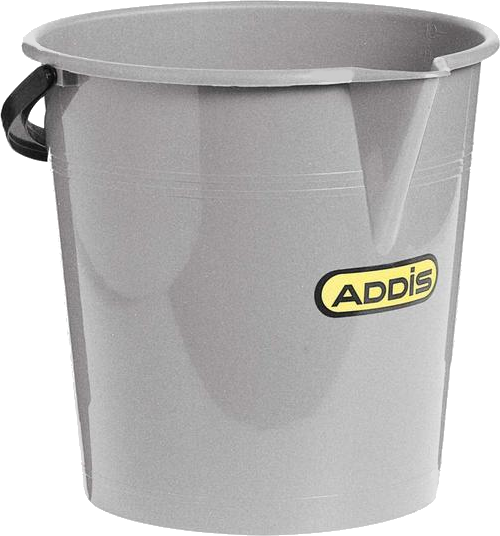

 

  
  <h3 align="center">Bit Buckets</h3>

## About The Project

Bash Buckets is a secure cloud file storage solution that utilises a bucket scheme.
An API is provided for interaction with the service (i.e. there is no user facing front-end).
Bash Buckets does however have a reporting and analytics page for System Administrators, this page is publicly accessible unless otherwise configured.

### Built With

* [Python3](https://www.python.org/about/)
* [Django](https://www.djangoproject.com/)
* [Bash](https://www.gnu.org/software/bash/)

## Contact

Daniel Scragg - [@0xWra1th](https://twitter.com/0xWra1th) - danielscragg@outlook.com

Project Link: [https://github.com/0xWra1th/Bash-Buckets](https://github.com/0xWra1th/Bash-Buckets)
